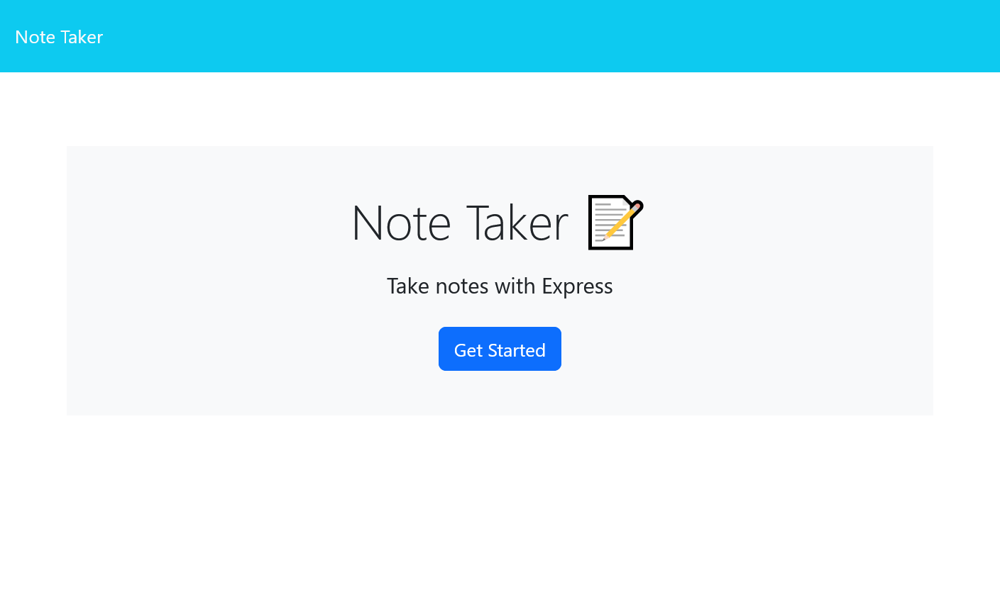
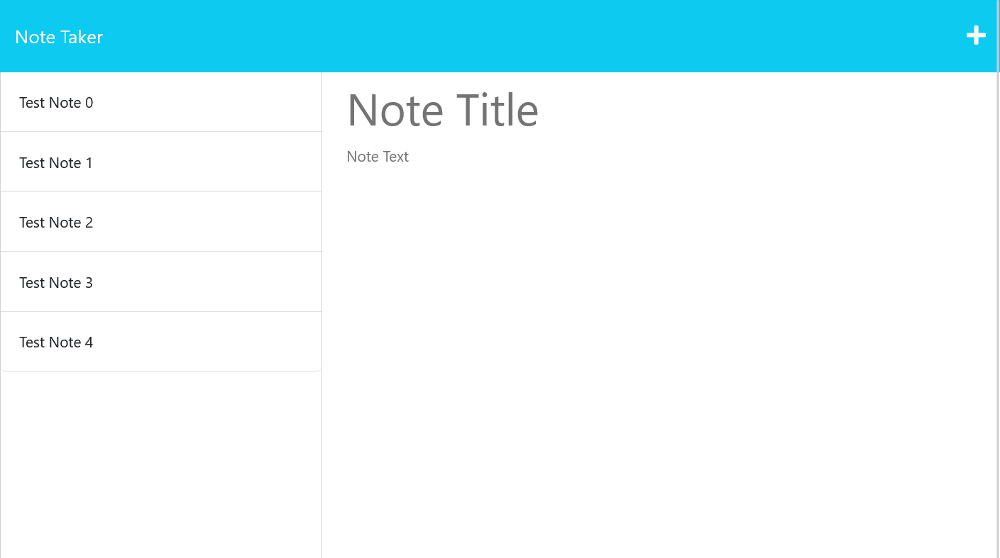
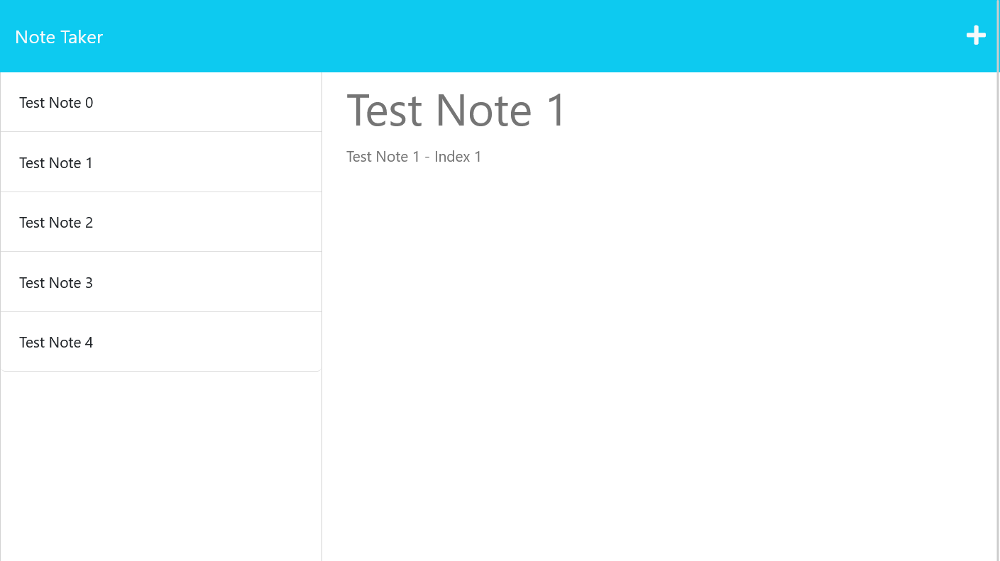
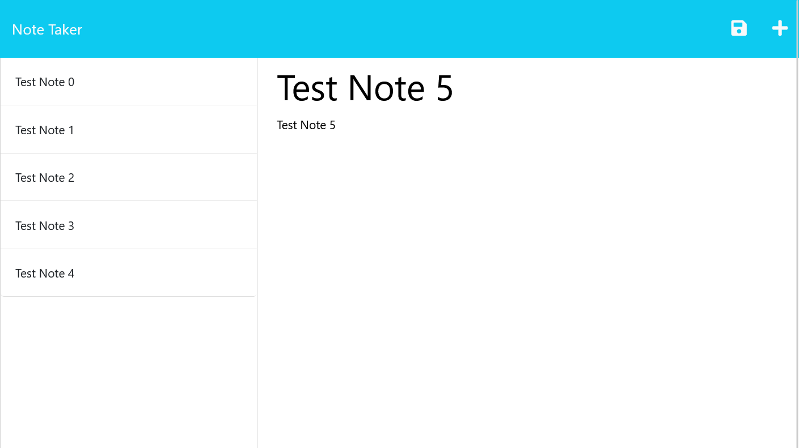
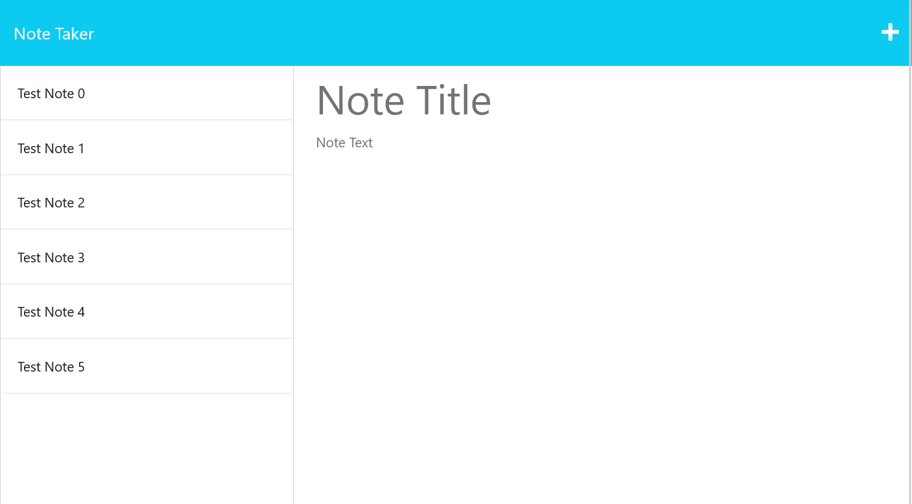

# Note Tracker - Module 11 Challenge

## Description

This web application allows a user to review notes and add new ones to a dashboard.

## Instalation

This app is a live application being served on Heroku, no installation is required.

## Usage

* Simply navigate to the Heroku page:

https://powerful-island-83683.herokuapp.com/

* Click on the GETTING STARTED button to navigate to the web application.

* Click on the left hand column note to display its text.

* Click on the PLUS button to add a new note.

* To save the new note, click on the SAVE ICON that appears after filling in the note's body. It will then be rendered as one of the notes in the  left-hand column.

## Credits

Coded by Jacob Jeffries
With started code provided by MSU Bootcamp

## License

MIT License

Copyright (c) [2023] [Jacob Jeffries]

Permission is hereby granted, free of charge, to any person obtaining a copy
of this software and associated documentation files (the "Software"), to deal
in the Software without restriction, including without limitation the rights
to use, copy, modify, merge, publish, distribute, sublicense, and/or sell
copies of the Software, and to permit persons to whom the Software is
furnished to do so, subject to the following conditions:

The above copyright notice and this permission notice shall be included in all
copies or substantial portions of the Software.

THE SOFTWARE IS PROVIDED "AS IS", WITHOUT WARRANTY OF ANY KIND, EXPRESS OR
IMPLIED, INCLUDING BUT NOT LIMITED TO THE WARRANTIES OF MERCHANTABILITY,
FITNESS FOR A PARTICULAR PURPOSE AND NONINFRINGEMENT. IN NO EVENT SHALL THE
AUTHORS OR COPYRIGHT HOLDERS BE LIABLE FOR ANY CLAIM, DAMAGES OR OTHER
LIABILITY, WHETHER IN AN ACTION OF CONTRACT, TORT OR OTHERWISE, ARISING FROM,
OUT OF OR IN CONNECTION WITH THE SOFTWARE OR THE USE OR OTHER DEALINGS IN THE
SOFTWARE.

